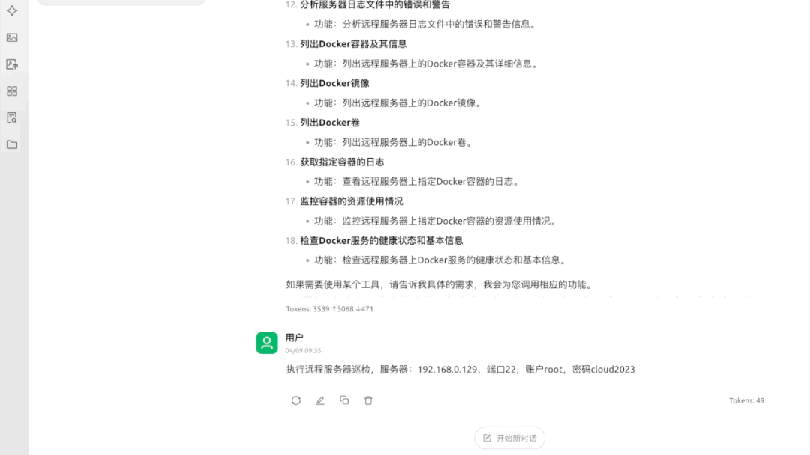
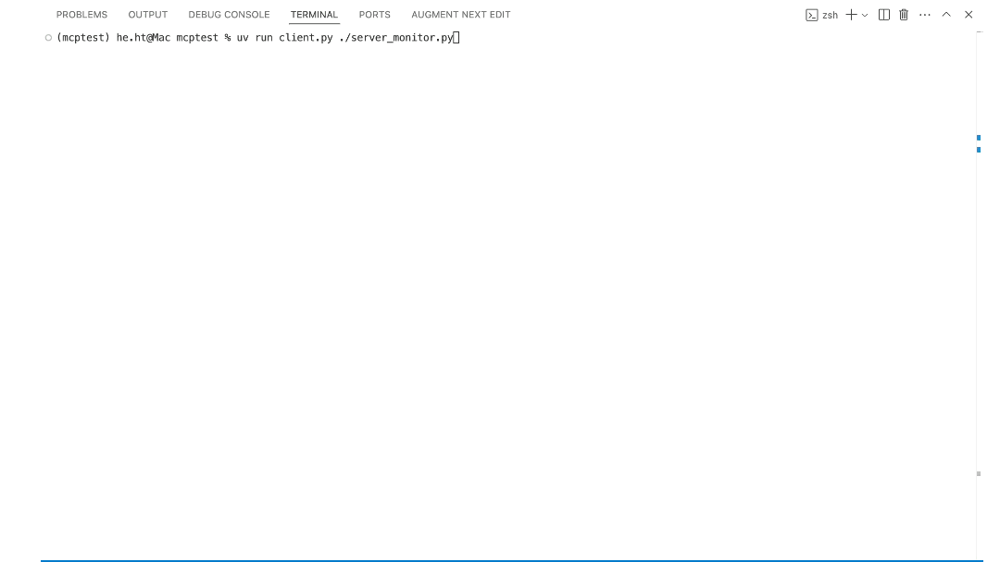

<div style="text-align: right; margin-bottom: 20px;">
  <a href="README_zh.md" style="padding: 8px 15px; background: #007bff; color: white; text-decoration: none; border-radius: 4px;">中文</a>
</div>

# ops-mcp-server Project

## Project Overview
The ops-mcp-server is an IT operations management solution for the AI era. It achieves intelligent IT operations through the seamless integration of the Model Context Protocol (MCP) and Large Language Models (LLMs). By leveraging the power of LLMs and MCP's distributed architecture, it transforms traditional IT operations into an AI-driven experience, enabling automated server monitoring, intelligent anomaly detection, and context-aware troubleshooting. The system acts as a bridge between human operators and complex IT infrastructure, providing natural language interaction for tasks ranging from routine maintenance to complex problem diagnosis, while maintaining enterprise-grade security and scalability.

### Key Highlights
- **Real-time Monitoring**: Continuous monitoring of system resources, services, and performance metrics
- **Automated Inspection**: Scheduled and on-demand inspection of server health and security status
- **Multi-vendor Support**: Compatible with various network device vendors including Cisco, Huawei, and H3C
- **Container-ready**: Built-in Docker container management and monitoring capabilities
- **Security-focused**: Integrated security scanning and risk assessment tools
- **Plugin System**: Extensible plugin architecture for adding new monitoring and management capabilities

### Demo Video
On Cherry Studio


## Features

### Server Monitoring Tools
- **Remote Server Inspection**: Perform remote server inspection including CPU, memory, disk and other modules
- **System Load Monitoring**: Get system load information
- **Process Monitoring**: Monitor remote server processes, return top resource-consuming processes
- **Service Status Check**: Check running status of specified services
- **Network Interface Check**: Check network interfaces and connection status
- **Log Analysis**: Analyze error and warning messages in server log files
- **Configuration Backup**: Backup important system configuration files
- **Security Vulnerability Scan**: Perform basic security vulnerability scanning
- **SSH Login Risk Check**: Check SSH login risks including failed attempts and suspicious IPs
- **Firewall Configuration Check**: Check firewall configuration and open ports
- **OS Details**: Get detailed operating system information

### Container Management Tools
- **Docker Container List**: List all Docker containers and their resource usage
- **Docker Image List**: List all Docker images on the server
- **Docker Volume List**: List all Docker volumes with size information
- **Container Logs**: Retrieve logs from specified container
- **Container Stats**: Monitor resource usage of containers
- **Docker Health Check**: Check Docker service health status and information

### Network Device Management Tools
- **Device Identification**: Identify network device types and basic information, auto-detect vendor (Cisco, Huawei, H3C, etc.)
- **Switch Port Check**: Check switch port status and configurations
- **Router Routes Check**: Check router routing tables by protocol
- **Network Config Backup**: Backup network device configurations
- **ACL Config Check**: Check security ACL configurations and rules
- **VLAN Inspection**: Check switch VLAN configurations and ports
- **Optical Module Detection**: Check optical module status, power levels, temperature and other key metrics, supporting multiple vendors
- **Device Performance Monitoring**: Monitor network device CPU, memory, temperature, interface traffic and buffer utilization
- **Device Session Analysis**: Monitor and analyze device sessions, identifying active connections, protocols, and potential security risks
- **Security Policy Analysis**: Analyze security policies on network devices, identify shadowed rules, overly permissive rules, and optimization opportunities

### Additional Features
- **Tool Listing**: List all available tools and their descriptions
- **Batch Operations**: Support simultaneous inspection tasks across multiple devices

## Installation
This project uses [`uv`](https://github.com/astral-sh/uv) for Python dependency and virtual environment management.

### 1. Install uv
```bash
curl -LsSf https://astral.sh/uv/install.sh | sh
```

### 2. Create and activate virtual environment
```bash
uv venv .venv
source .venv/bin/activate  # Linux/macOS
# or
.\.venv\Scripts\activate   # Windows
```

### 3. Install project dependencies
Make sure you have Python 3.10 or higher installed, then use the following command to install project dependencies:
```bash
uv pip install -r requirements.txt
```

Note: Dependency information can be found in the `pyproject.toml` file.

## SSE Remote Deployment

### Using UV Environment

1. Activate UV environment
   ```bash
   # Create virtual environment (if not already created)
   uv venv
   # Activate virtual environment
   source .venv/bin/activate
   ```

2. Install dependencies
   ```bash
   # Navigate to server_monitor_sse directory
   cd server_monitor_sse
   # Install dependencies
   pip install -r requirements.txt
   ```

3. Start the service
   ```bash
   # Return to ops-mcp-server directory
   cd ..
   # Start the service
   uv run server_monitor_sse --transport sse --port 8000
   ```

### Using Docker Compose

1. Ensure Docker and Docker Compose are installed

2. Navigate to server_monitor_sse directory
   ```bash
   cd server_monitor_sse
   ```

3. Start the service with Docker Compose
   ```bash
   docker compose up -d
   ```

4. Check service status
   ```bash
   docker compose ps
   ```

5. View logs
   ```bash
   docker compose logs -f
   ```

## Local MCP Server Configuration（Stdio）
To add this project as an MCP server, add the following configuration to your settings file:

```json
"ops-mcp-server": {
      "command": "uv",
      "args": [
        "--directory",
        "YOUR_PROJECT_PATH_HERE",  // Replace with your actual project path
        "run",
        "server_monitor.py"
      ],
      "env": {},
      "disabled": true,
      "autoApprove": [
        "list_available_tools"
      ]
    },
"network_tools": {
      "command": "uv",
      "args": [
        "--directory",
        "YOUR_PROJECT_PATH_HERE",  // Replace with your actual project path
        "run",
        "network_tools.py"
      ],
      "env": {},
      "disabled": false,
      "autoApprove": []
    }
```

## Client Usage
This project provides an interactive client `client.py` that allows you to interact with MCP services using natural language.

### Client Demo Video
On Terminal


### Installing Client Dependencies
The client requires additional libraries `openai` and `rich`:
```bash
uv pip install openai rich
```

### Starting the Client
Use the following command to start the client:
```bash
uv run client.py [path/to/server.py]
```
For example:
```bash
uv run client.py ./server_monitor.py
```

### Configuring the Client
Before using, you need to modify the following configurations in `client.py`:
1. `api_key` - Set to your LLM API key
2. `base_url` - Set to your LLM API endpoint
3. `model` - Set to the model name you want to use

The configuration is located in the `MCPClient` class initialization section of `client.py`:
```python
# Initialize OpenAI client
api_key = "YOUR_API_KEY"
base_url="https://your-api-endpoint"
self.client = AsyncOpenAI(
    base_url=base_url,
    api_key=api_key,
)

# Set model
self.model = "your-preferred-model"
```

### Client Commands
The following commands are available in the client:
- `help` - Display help information
- `quit` - Exit the program
- `clear` - Clear conversation history
- `model <name>` - Switch models

## License
This project is licensed under the [MIT License](LICENSE).

## Notes
- Ensure the remote server's SSH service is running properly and you have appropriate permissions.
- Adjust parameters according to actual conditions when using tools.
- The project is currently being improved...

